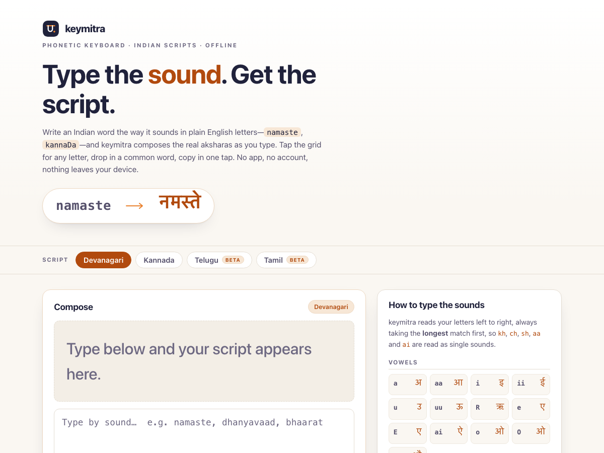

# keymitra

**Type the sound. Get the script.** A phonetic keyboard and transliterator for Indian scripts. Write a word the way it sounds in plain English letters — `namaste`, `kannaDa` — and keymitra composes the real aksharas as you type. Tap an on-screen grid for any letter, drop in a common word, copy in one tap. 100% client-side, zero dependencies, works fully offline.

## Why

Most Indian scripts have no comfortable input method on a laptop, and switching a phone to a native keyboard for one word is friction. But nearly everyone already knows how their language *sounds* — and can spell it in Latin letters. keymitra turns that instinct into correct Unicode.

You type the sound left to right; keymitra reads it with **longest-match** so digraphs like `kh`, `ch`, `sh`, `aa` and `ai` are understood as single sounds, joins consonants and vowels into the right akshara, adds the correct dependent vowel signs (matras), inserts a virama for consonant clusters, and handles anusvara, visarga and digits. The composed script is the hero of the page — big and live — so you always see exactly what you're building. **Devanagari** (Hindi, Marathi, Sanskrit) and **Kannada** are verified against exact Unicode; **Tamil** and **Telugu** are included and clearly marked *beta*.

## Features

- **Phonetic composing** — type by sound in Latin; the script updates live as you type. `namaste` → नमस्ते, `kannaDa` → ಕನ್ನಡ.
- **Longest-match tokenising** — `bh`, `chh`, `Sh`, `aa`, `ai` and friends are read as single sounds, not letter by letter.
- **Correct syllable rules** — consonant + vowel becomes a base glyph plus the right matra; two consonants in a row join as a cluster with a virama; a word-final consonant keeps its inherent short *a*, and `.h` forces a bare consonant (halant).
- **Akshara grid** — a tappable grid of the current script's vowels and consonants for direct insertion, with the Latin key shown on each.
- **Common-word chips** — one tap inserts everyday words (greetings, thanks, yes/no) for the active script.
- **One-tap copy** — copy the composed script to paste anywhere.
- **Four scripts** — Devanagari and Kannada fully covered; Tamil and Telugu marked *beta* so you know where to double-check.
- **Built-in cheat sheet** — every vowel, mark and digit mapping is on the page; nothing to memorise.
- **100% offline** — no accounts, no network calls, no tracking. Your last text is saved only in this browser's local storage.

## Quickstart

Just open `index.html` in any modern browser — no build step, no server, no install.

- **Local:** double-click `index.html`, or run a static server in the folder.
- **Hosted:** **[Open keymitra live](https://sreenivas-sadhu-prabhakara.github.io/keymitra/)**

Your chosen script and last text are saved in your browser's local storage, so they persist between visits on the same device. To display a script, your device needs a font for it installed (most phones and computers ship with Devanagari and Kannada) — keymitra ships no fonts, so the text is always correct Unicode even if a glyph shows as an empty box.

## Privacy

- A strict Content-Security-Policy sets `connect-src 'none'`: the app **cannot** make any network request, even if it tried.
- No external fonts, scripts, images, or analytics. Everything is self-contained.
- All logic runs in your browser. Nothing you type is ever transmitted or stored anywhere but your own device.
- Because there are no network dependencies, it keeps working offline — download it once and it runs with no connection at all.

## Disclaimer

keymitra is a **typing aid, not a certified transliteration standard**. It follows a practical ITRANS-style scheme: Devanagari and Kannada are verified against exact Unicode, while **Tamil and Telugu are marked *beta*** and can collapse sounds their scripts do not natively encode (Tamil, for example, has a single letter where Sanskrit distinguishes aspirated and voiced consonants). Correct rendering also depends on the target script's font being installed on your device — keymitra ships none. The output is provided for your own convenience; **always proofread important text** before relying on it. This software is provided under the MIT License, "as is", without warranty of any kind; the authors accept no liability for any loss, error, or damage arising from its use.

## License

[MIT](./LICENSE) © 2026 Sreenivas Sadhu Prabhakara
